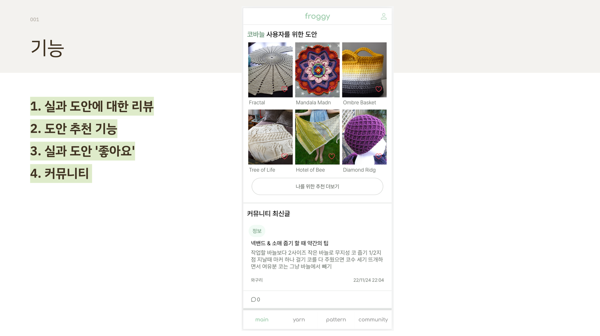
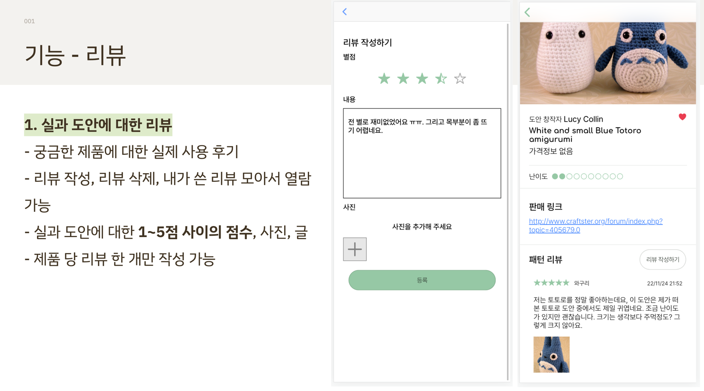
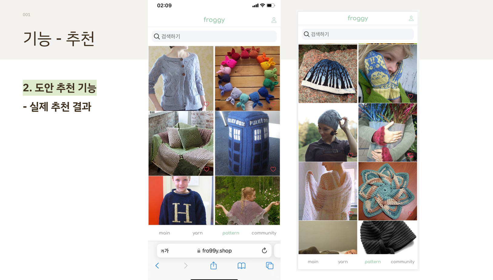
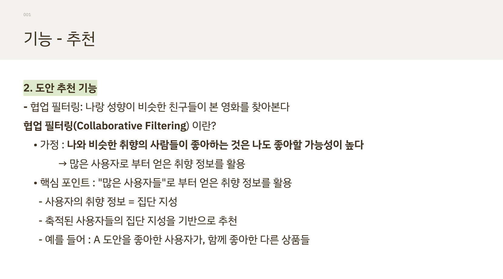
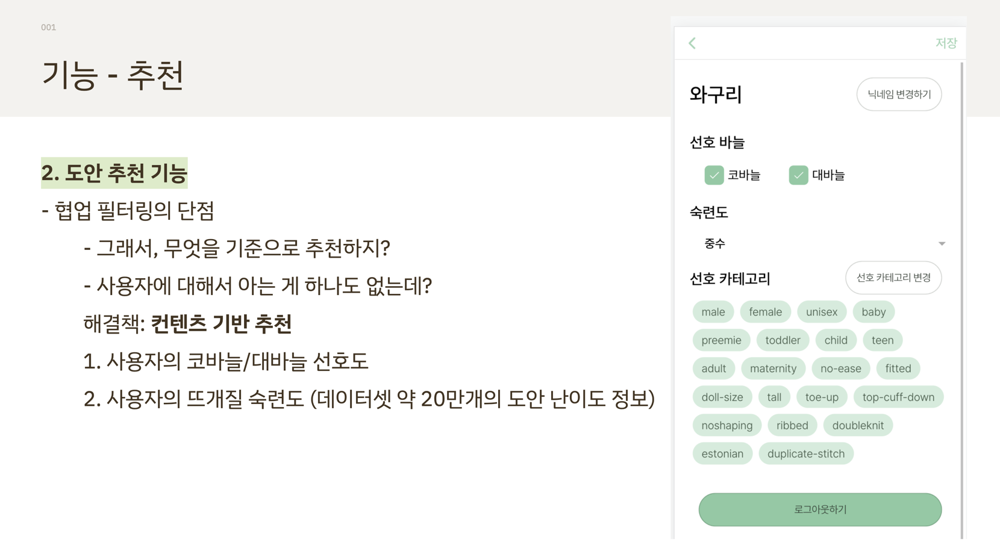
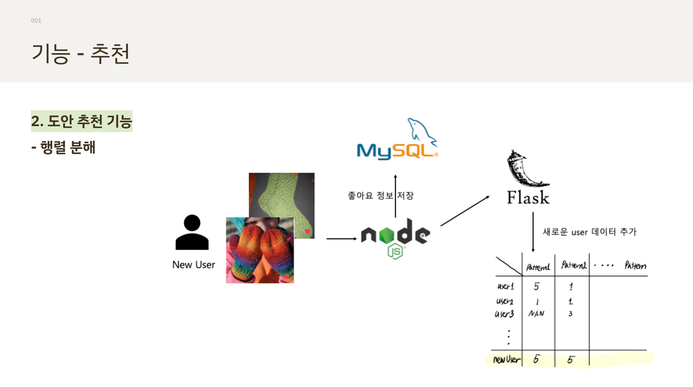
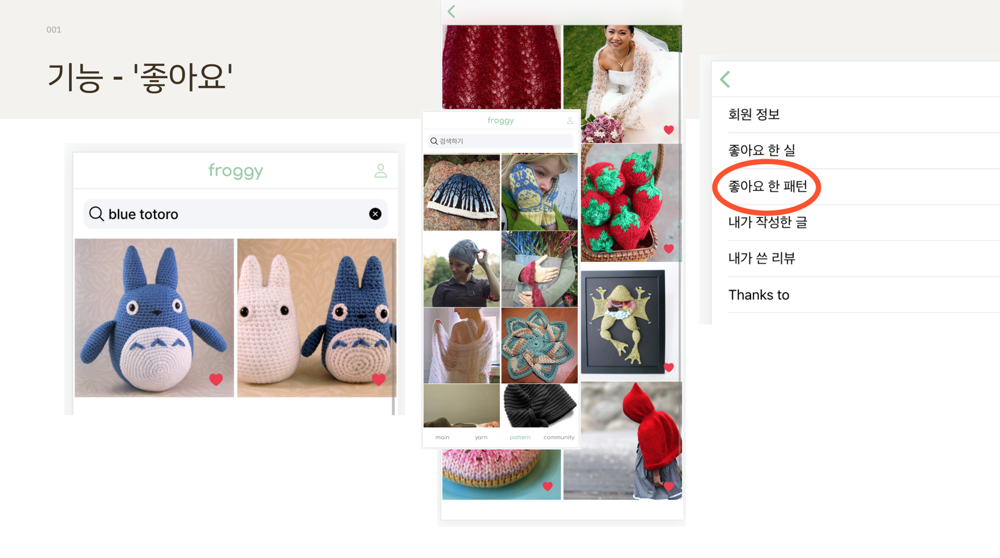
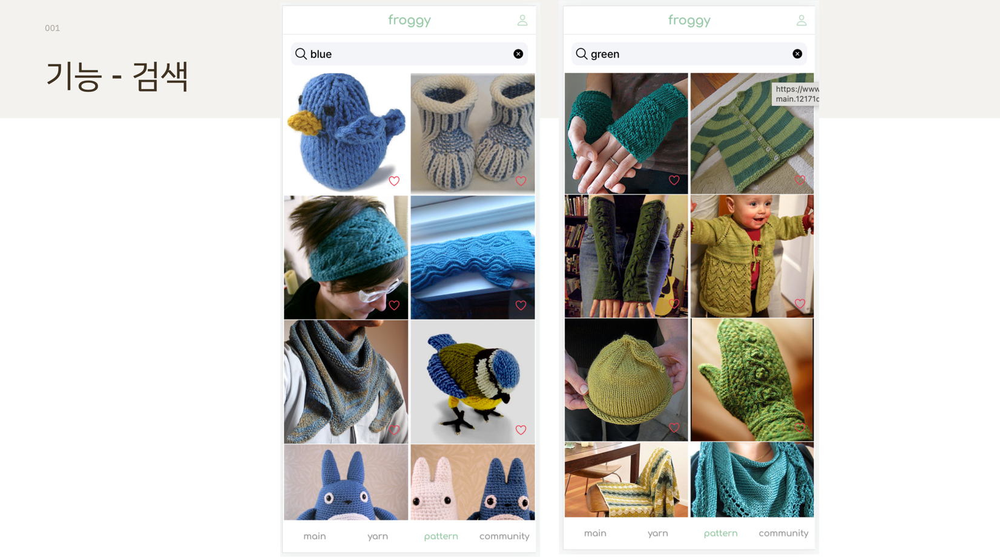
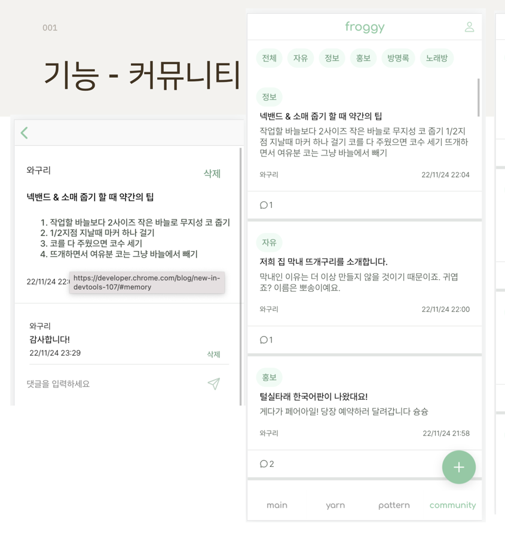

# froggy

### 목차

1. 개요
2. 기능
3. 사용 알고리즘
4. 사용 기술
5. 팀원의 역할

## 개요

뜨개질 인구가 다양한 도안과 실에 대한 정보를 공유하고, 소통할 수 있는 사이트를 만들고자 했습니다. 뿐만 아니라 사용자의 취향에 맞는 실과 도안을 추천하여 Raverly와의 차별점을 두고자 하였습니다.

뜨개구리를 본 경험이 있으신가요 ?

이 뜨개구리는 해외 사이트 Raverly의 뜨개 도안으로, 트위터에서 인기를 끌어 주 연령층이 높던 뜨개질에 팬데믹 시기에 젊은 인구가 많이 유입되었습니다.

그러나 라이벌리의 경우 단순한 검색 기능과 리뷰 기능들만 존재합니다. 그래서 사용자들이 정보를 얻기 위해서는 직접 도안의 이름을 알아서 검색해야 한다는 단점이 있습니다. 또한 신규 디자이너들의 도안은 유저들에게 주목받기 어렵습니다.

국내에도 해외 도안에 대한 정보를 얻기 위해서 라이벌리를 사용하는 뜨개 인구들이 많이 있습니다.

그런데 해외 사이트이기 때문에 영어로 되어 있어서 한국 유저들이 사용하는데, 불편함이 있을 수 밖에 없습니다.

## 기능

### 1. 리뷰기능

### 2. 추천

#### 컨텐츠 기반 추천

#### 협업 필터링

### 3. 실, 도안 좋아요

   메인 페이지의 추천이나, 패턴, 실 탭을 살펴보며 회원들은 마음에 드는 실과 도안에 대한 '좋아요'를 누를 수 있습니다.

   이후에 자신이 좋아요 한 실과 도안들을 마이 페이지에서도 조회할 수 있습니다.

### 4. 검색기능

   프로기는 실과 도안을 이름으로 검색할 수 있는 기능을 가지고 있습니다.

   검색어를 입력하고 엔터를 치면 해당하는 실과 패턴을 조회할 수 있습니다.

### 5. 커뮤니티

   저희의 목표는 실과 도안에 대한 정보를 얻을수 있으며, 한국의 뜨개질 유저들이 모일 수 있는 공간을 만들고자 하는 것 이었습니다. 따라서 저희는 커뮤니티 또한 구현하였습니다.

   따라서 커뮤니티 글쓰기, 댓글 쓰기, 글 삭제 ,댓글 삭제, 카테고리 모아보기 등 기본적인 커뮤니티 기능들을 구현하였습니다.

   또한 마이페이지에 가면 내가 쓴 글을 모아 볼 수 있습니다.

